# Iffy Engine Architecture

## Overview

Iffy is a modern LLM-powered Interactive Fiction Engine built with TypeScript, designed for natural language storytelling experiences. The engine combines traditional IF mechanics with AI-driven narrative generation to create dynamic, responsive stories.

## Core Design Principles

1. **LLM-First Design**: Natural language understanding at the core
2. **Modular Architecture**: Clear separation of concerns
3. **Format v2 Compatibility**: Support for modern YAML-based story definitions
4. **Developer Experience**: Easy story creation and validation
5. **Player Experience**: Intuitive natural language commands

## System Architecture

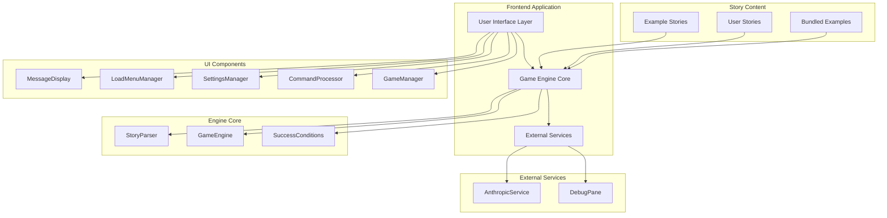

## Component Architecture

### UI Layer Components

The UI layer is organized into focused manager classes, each handling a specific aspect of the user interface:

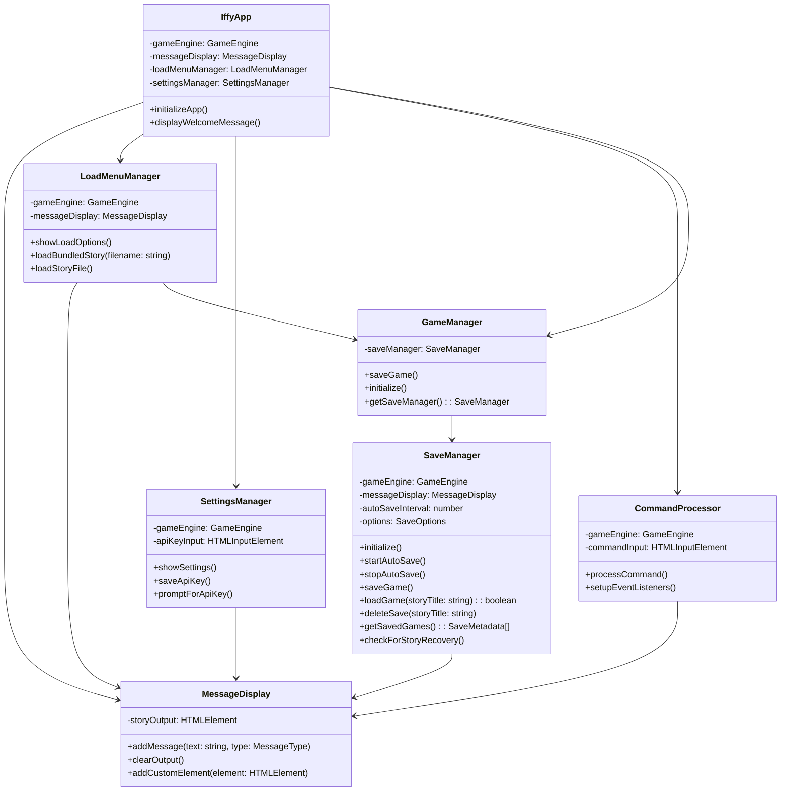

### Engine Layer

The engine layer handles story parsing, game state management, and AI integration:

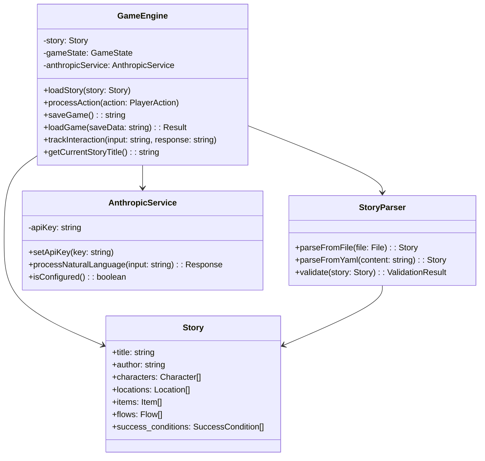

## Save System Architecture

### Enhanced Save System (Phase 1)

The save system has been enhanced to provide auto-save functionality, complete interaction history preservation, and crash recovery:

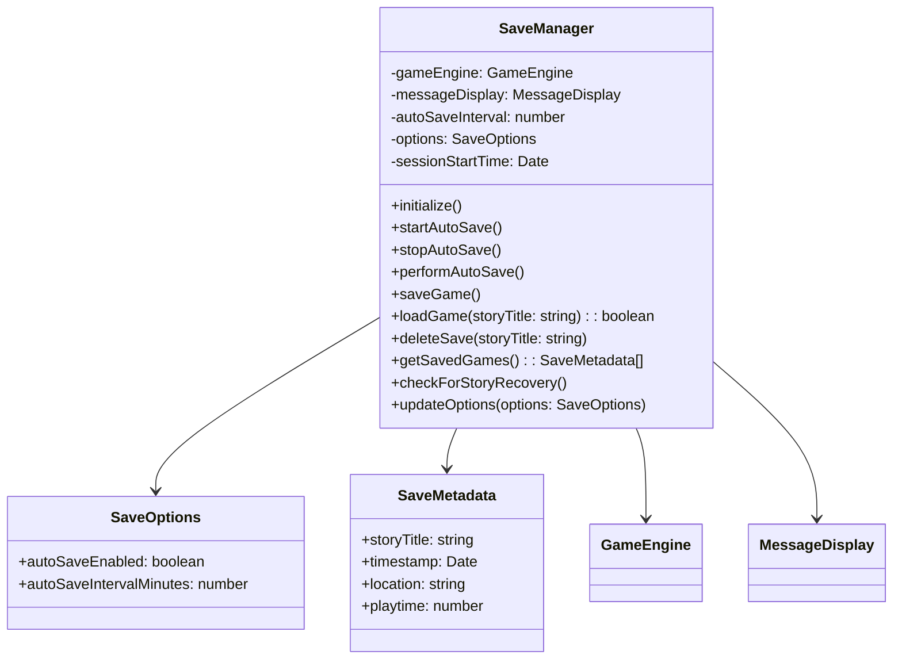

### Save System Features

1. **Auto-Save**: Automatic saves every 2 minutes during active gameplay
2. **LocalStorage Persistence**: Saves persist across browser sessions
3. **Complete History**: Removed 5-interaction limit for full session preservation
4. **Recovery Detection**: Prompts for recent saves (<30 minutes old) on story load
5. **Save Management**: One save per story with delete functionality
6. **Dual Format**: Both localStorage and JSON download support

### Save Data Flow

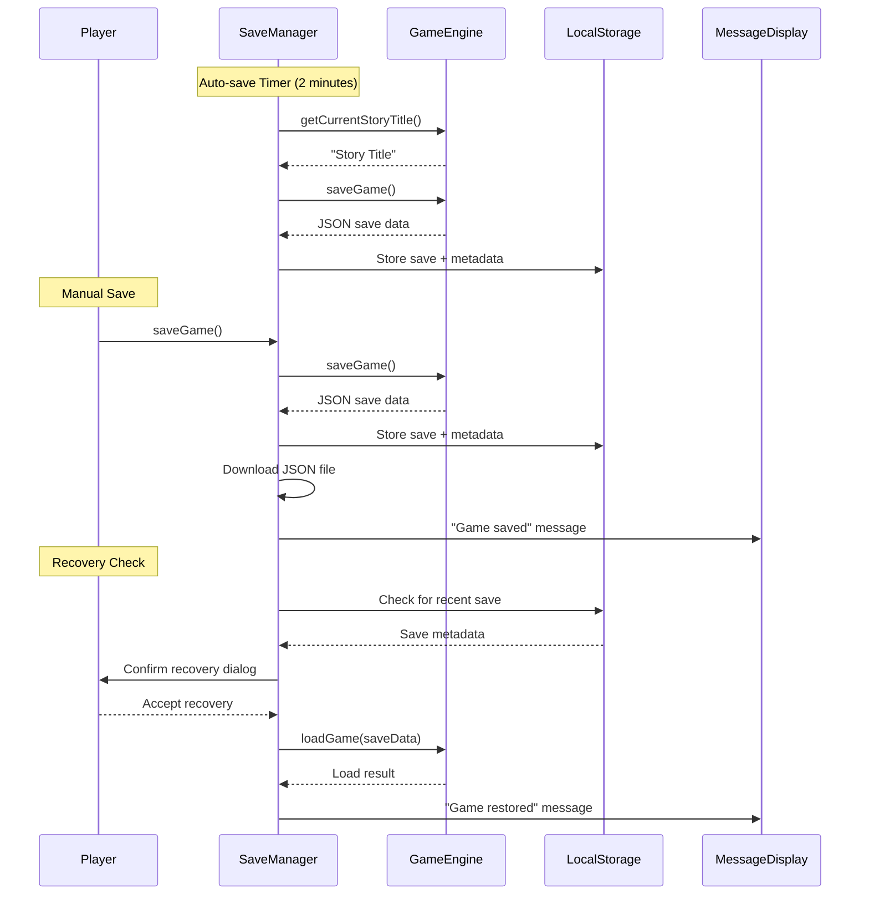

## Data Flow

### Command Processing Flow

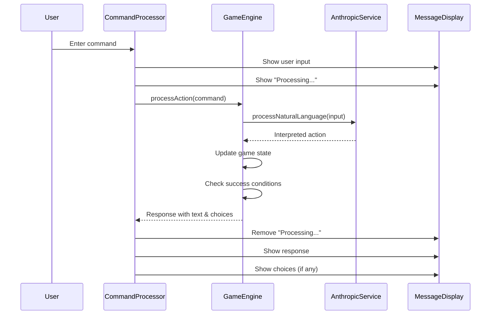

### Story Loading Flow

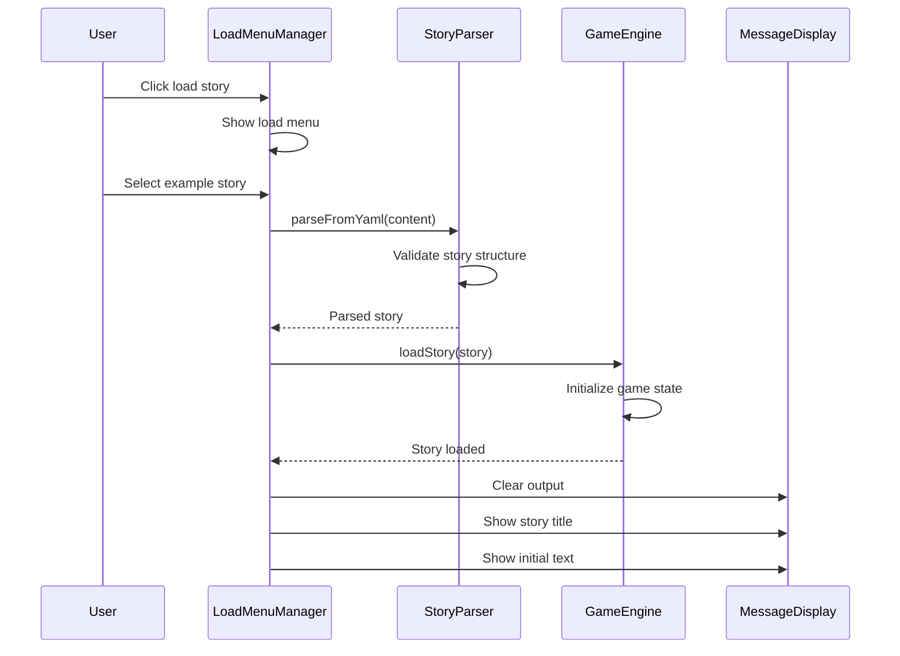

## Build System

### Build Pipeline

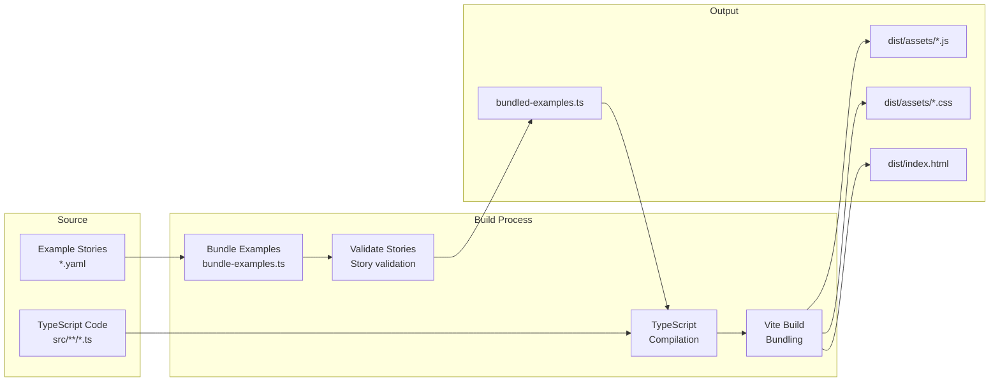

### Story Validation Pipeline

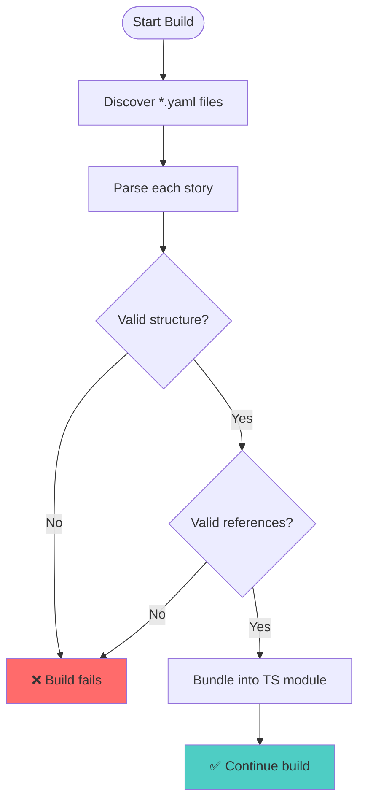

## Story Format

### Format v2 Structure

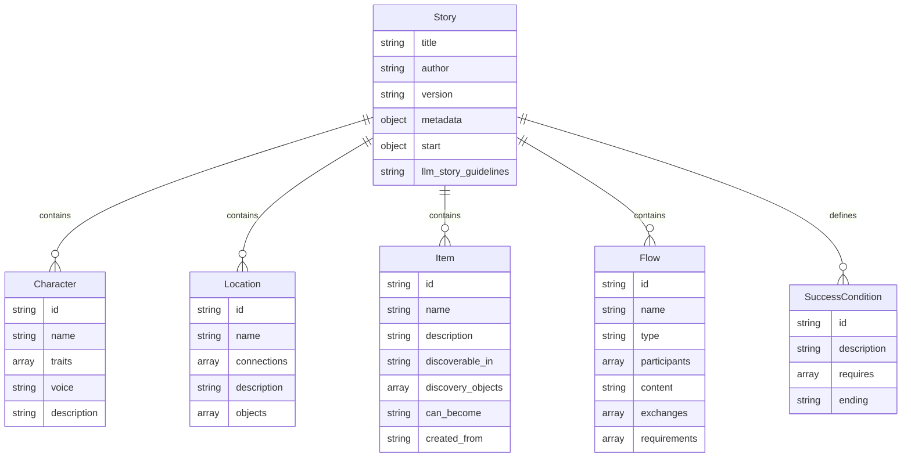

## Testing Strategy

### Test Coverage Areas

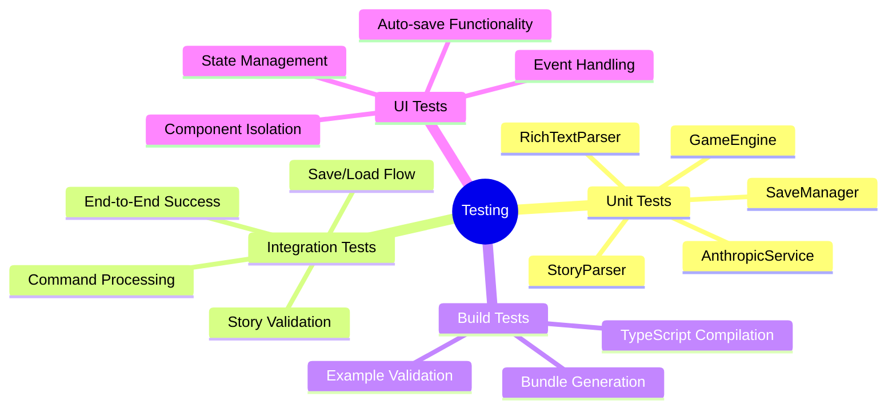

## Deployment

### Deployment Architecture

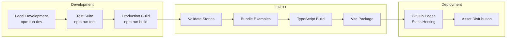

## Security Considerations

1. **API Key Management**: Client-side storage with user control
2. **Content Validation**: All stories validated at build time  
3. **Input Sanitization**: Rich text parser prevents XSS
4. **No Server Dependencies**: Fully client-side application

## Performance Characteristics

- **Bundle Size**: ~191KB gzipped
- **Load Time**: <2s on 3G networks
- **Memory Usage**: ~50MB runtime
- **Responsiveness**: <100ms UI interactions

## Future Architecture Considerations

1. **Plugin System**: Extensible story mechanics
2. **Cloud Storage**: Cross-device save synchronization
3. **Multiplayer**: Shared story experiences
4. **Mobile**: Progressive Web App capabilities
5. **Offline**: Service worker story caching