# Development Guide

## Overview

This guide provides comprehensive information for developers working on the Iffy Interactive Fiction Engine. It covers the development workflow, coding standards, testing practices, and deployment procedures.

## Project Structure

```
iffy/
├── src/                     # Source code
│   ├── components/         # Reusable components
│   ├── engine/            # Core game engine
│   ├── services/          # External service integrations
│   ├── tests/             # Test files
│   ├── types/             # TypeScript type definitions
│   ├── ui/                # UI manager classes
│   └── utils/             # Utility functions
├── examples/               # Example story files
├── scripts/               # Build and utility scripts
├── docs/                  # Documentation
└── dist/                  # Built application
```

## Development Workflow

### Setup and Installation

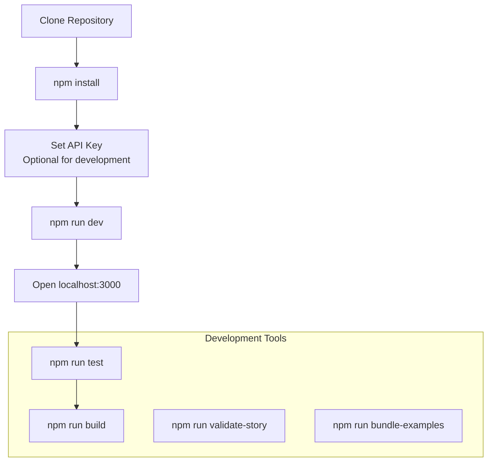

### Daily Development Process

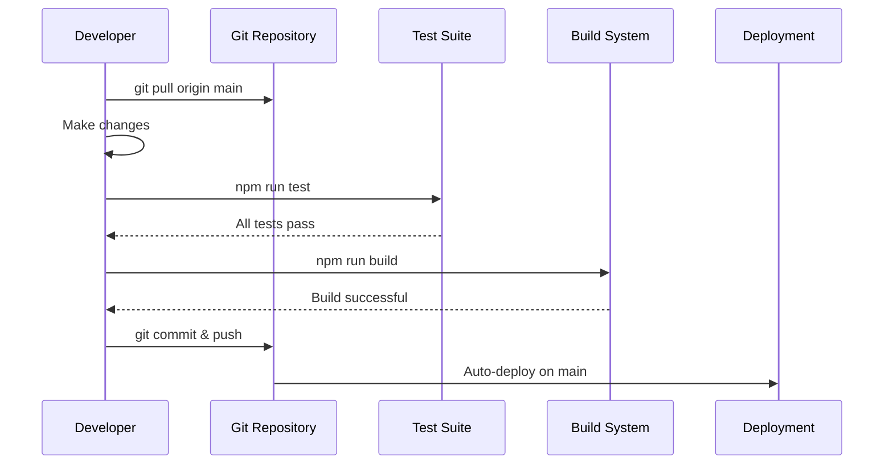

## Code Organization

### Module Dependency Graph

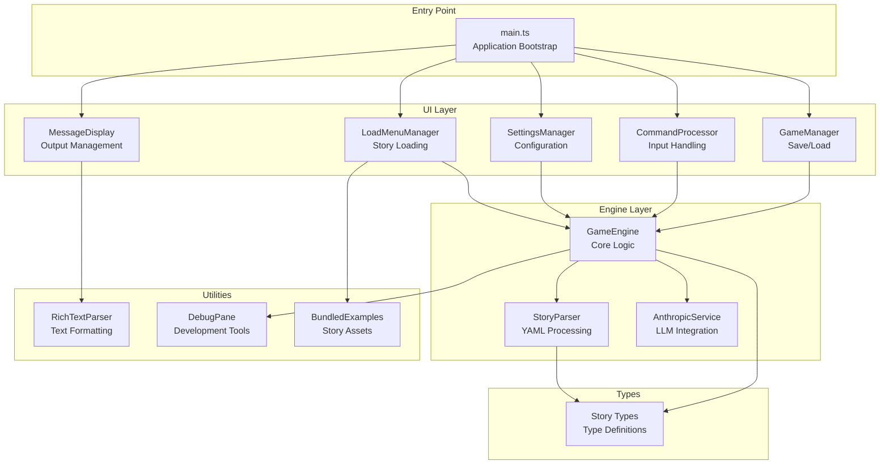

## Coding Standards

### TypeScript Standards

```typescript
// Use explicit types for public interfaces
interface StoryConfig {
  title: string;
  author: string;
  version: string;
}

// Use type unions for known sets
type MessageType = 'story' | 'input' | 'error' | 'system' | 'choices' | 'title';

// Use generics for reusable components
class Manager<T extends Element> {
  protected element: T;
  constructor(element: T) {
    this.element = element;
  }
}

// Document complex methods
/**
 * Process a player action through the LLM and update game state
 * @param action - The player's natural language input
 * @returns Promise resolving to game response with narrative text
 */
async processAction(action: PlayerAction): Promise<GameResponse> {
  // Implementation
}
```

### File Organization Standards

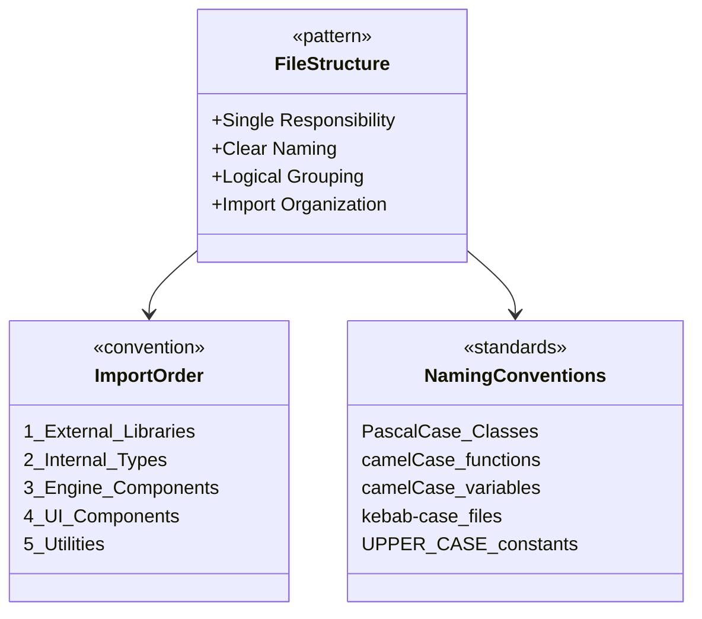

### CSS Standards

```css
/* Use CSS custom properties for theming */
:root {
  --primary-color: #1a1a2e;
  --text-color: #ffffff;
  --border-color: #333366;
  --accent-color: #4ecdc4;
}

/* Follow BEM-like naming for components */
.story-text {
  /* Base styles */
}

.story-text--error {
  /* Modifier styles */
}

.story-text__content {
  /* Element styles */
}

/* Use logical properties when possible */
.container {
  margin-inline: auto;
  padding-block: 1rem;
}
```

## Testing Strategy

### Test Architecture

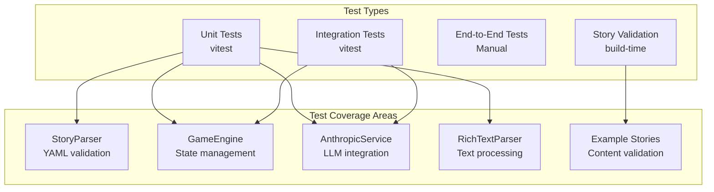

### Test File Structure

```typescript
// src/tests/gameEngine.test.ts
import { describe, it, expect, beforeEach } from 'vitest';
import { GameEngine } from '@/engine/gameEngine';
import { StoryParser } from '@/engine/storyParser';

describe('GameEngine', () => {
  let engine: GameEngine;
  let testStory: Story;

  beforeEach(async () => {
    engine = new GameEngine();
    testStory = StoryParser.parseFromYaml(SIMPLE_TEST_STORY);
    engine.loadStory(testStory);
  });

  describe('processAction', () => {
    it('should process simple look command', async () => {
      const response = await engine.processAction({
        type: 'command',
        input: 'look',
        timestamp: new Date()
      });
      
      expect(response.text).toContain('kitchen');
      expect(response.error).toBe(false);
    });
  });
});
```

### Running Tests

```bash
# Run all tests
npm run test:run

# Run tests in watch mode
npm run test

# Run tests with UI
npm run test:ui

# Test specific file
npm run test gameEngine.test.ts
```

## Story Development

### Story Creation Workflow

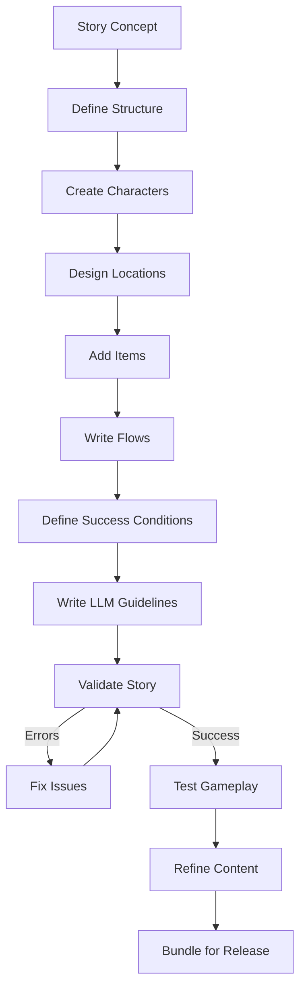

### Story Validation Process

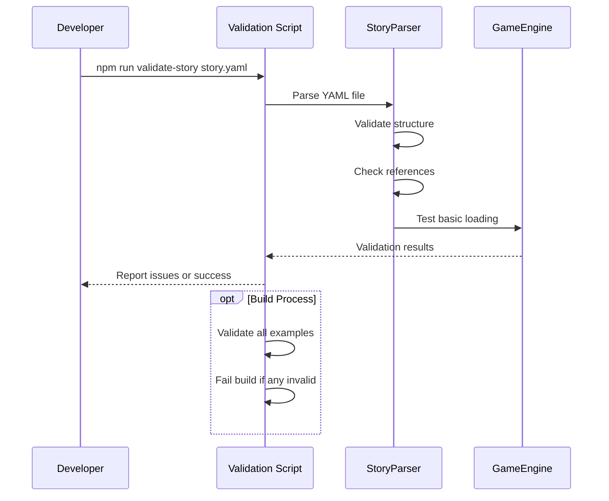

### Example Story Template

```yaml
title: "Story Title"
author: "Author Name"
version: "2.0"

metadata:
  setting:
    time: "When does this take place?"
    place: "Where does this happen?"
  tone:
    overall: "What's the overall feel?"
    narrative_voice: "How should the narrator sound?"
  themes:
    - "Theme 1"
    - "Theme 2"

characters:
  - id: "player"
    name: "Player Character"
    traits: ["trait1", "trait2"]
    voice: "How they speak"
    description: "Character description"

locations:
  - id: "start_location"
    name: "Starting Area"
    connections: []
    description: "Location description"
    objects:
      - name: "object_name"
        description: "Object description"

items:
  - id: "item_id"
    name: "Item Name"
    description: "Item description"
    discoverable_in: "start_location"
    discovery_objects: ["object_name"]

success_conditions:
  - id: "winning_condition"
    description: "How the player wins"
    requires: ["knowledge_flag"]
    ending: "Ending text"

flows:
  - id: "start_flow"
    name: "Opening"
    type: "narrative"
    content: "Opening story text"

start:
  text: "Initial game text"
  location: "start_location"
  first_flow: "start_flow"

llm_story_guidelines: |
  Instructions for the LLM about tone, mechanics, and knowledge flags.
```

## Build System

### Build Pipeline Architecture

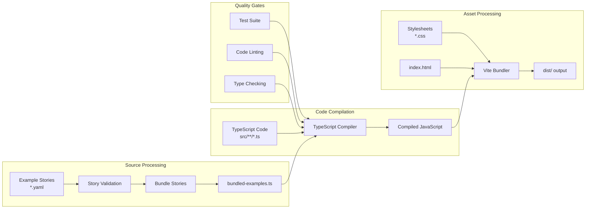

### Build Scripts

```json
{
  "scripts": {
    "dev": "vite",
    "build": "npm run bundle-examples && tsc && vite build",
    "build:gh-pages": "NODE_ENV=production npm run build",
    "preview": "vite preview",
    "type-check": "tsc --noEmit",
    "validate-story": "tsx scripts/validate-story.ts",
    "bundle-examples": "tsx scripts/bundle-examples.ts",
    "test": "vitest",
    "test:run": "vitest run",
    "test:ui": "vitest --ui"
  }
}
```

### Custom Build Scripts

#### Example Bundling Script

```typescript
// scripts/bundle-examples.ts
function bundleExampleStories() {
  const examplesDir = resolve(__dirname, '../examples');
  const outputPath = resolve(__dirname, '../src/bundled-examples.ts');
  
  // Discover and validate all story files
  const files = readdirSync(examplesDir).filter(file => 
    file.endsWith('.yaml') || file.endsWith('.yml')
  );
  
  const stories: ExampleStory[] = [];
  let validationErrors = 0;
  
  for (const file of files) {
    try {
      const content = readFileSync(join(examplesDir, file), 'utf-8');
      const story = StoryParser.parseFromYaml(content);
      
      stories.push({
        filename: file,
        title: story.title,
        author: story.author,
        description: generateDescription(story),
        content
      });
    } catch (error) {
      validationErrors++;
      console.error(`❌ ${file} failed validation:`, error.message);
    }
  }
  
  if (validationErrors > 0) {
    console.error(`💥 Build failed: ${validationErrors} story validation errors`);
    process.exit(1);
  }
  
  // Generate TypeScript module
  const moduleContent = generateBundleModule(stories);
  writeFileSync(outputPath, moduleContent, 'utf-8');
}
```

## Deployment

### Deployment Pipeline

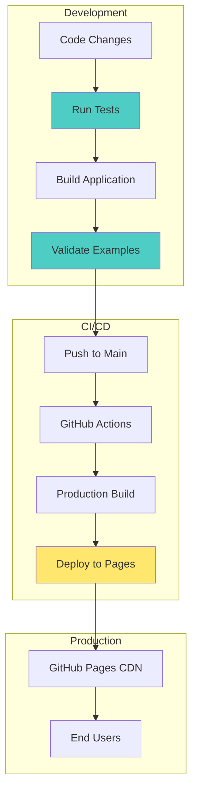

### Environment Configuration

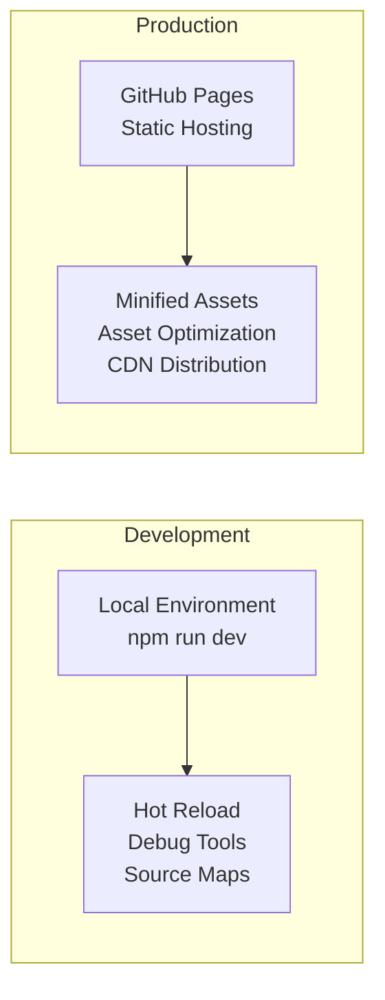

## Performance Monitoring

### Key Metrics

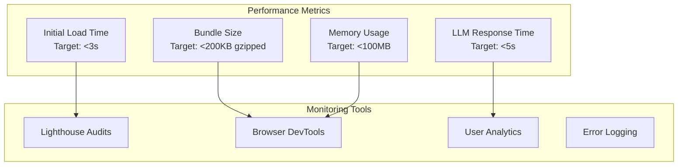

### Optimization Strategies

1. **Code Splitting**: Dynamic imports for large dependencies
2. **Asset Optimization**: Image compression and lazy loading
3. **Bundle Analysis**: Regular bundle size monitoring
4. **Caching**: Aggressive caching of static assets
5. **Performance Budget**: Automated performance regression detection

## Contributing Guidelines

### Pull Request Process

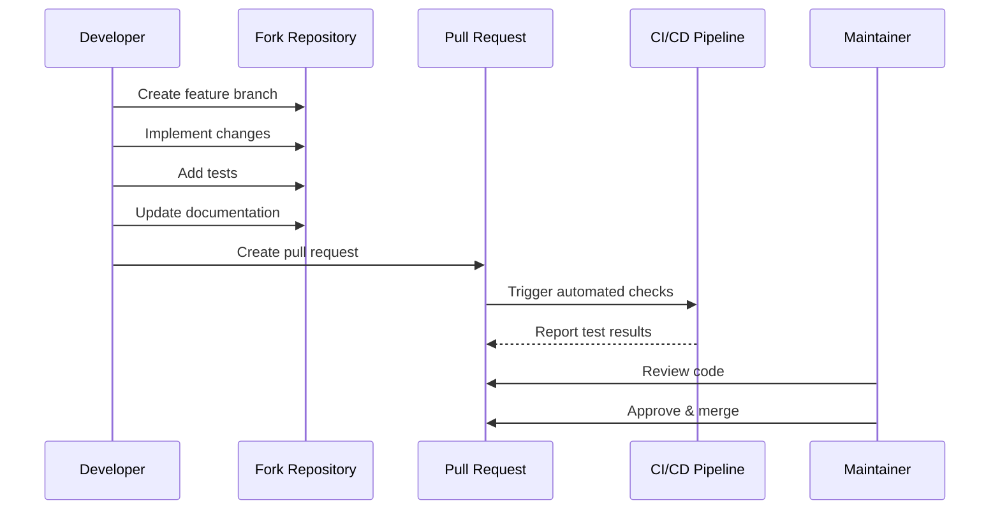

### Code Review Checklist

- [ ] **Functionality**: Does the code do what it's supposed to do?
- [ ] **Tests**: Are there appropriate tests for new functionality?
- [ ] **Documentation**: Is the code well-documented?
- [ ] **Performance**: Does the change impact performance?
- [ ] **Security**: Are there any security implications?
- [ ] **Style**: Does the code follow project conventions?
- [ ] **Breaking Changes**: Are breaking changes properly documented?

## Save/Load System Best Practices

### Architecture Principles

The save/load system is designed with several key principles:

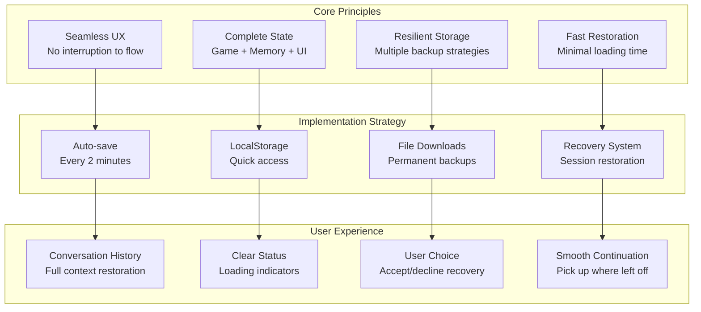

### Save Data Structure

```typescript
// Complete save data format
interface SaveData {
  storyTitle: string;
  timestamp: string;
  gameState: {
    currentLocation: string;
    inventory: string[];
    knowledge: string[];  // Converted from Set for JSON serialization
    gameEnded: boolean;
    endingId?: string;
    actionHistory: PlayerAction[];
  };
  memoryState: {
    recentInteractions: InteractionPair[];
    significantMemories: SignificantMemory[];
    interactionsSinceLastExtraction: number;
  };
}
```

### Testing Save/Load Functionality

```typescript
// Example test patterns for save/load
describe('Save/Load System', () => {
  it('should preserve complete game state', () => {
    // Setup game state
    gameEngine.processAction({ type: 'command', input: 'take coffee' });
    
    // Save current state
    const saveData = gameEngine.saveGame();
    
    // Reset and load
    gameEngine.resetForNewGame();
    const result = gameEngine.loadGame(saveData);
    
    expect(result.success).toBe(true);
    expect(gameEngine.gameState.inventory).toContain('coffee');
  });
  
  it('should restore conversation history', () => {
    // Mock conversation history
    const interactions = [
      { playerInput: 'test', llmResponse: 'response', ... }
    ];
    
    messageDisplay.restoreConversationHistory(interactions);
    
    // Verify DOM contains restored messages
    expect(storyOutput.textContent).toContain('test');
    expect(storyOutput.textContent).toContain('response');
  });
});
```

### Error Handling Patterns

```typescript
// Graceful degradation for save/load errors
class SaveManager {
  saveGame(): void {
    try {
      const saveData = this.gameEngine.saveGame();
      this.saveToLocalStorage(saveData);
      this.downloadSaveFile(saveData); // Backup strategy
    } catch (error) {
      if (error.name === 'QuotaExceededError') {
        this.messageDisplay.addMessage(
          'Storage full. Please delete old saves.',
          'error'
        );
      } else {
        this.messageDisplay.addMessage(
          'Save failed. Game progress may be lost.',
          'error'
        );
      }
      console.error('Save failed:', error);
    }
  }
  
  loadGame(storyTitle: string): boolean {
    try {
      const saveData = localStorage.getItem(this.getSaveKey(storyTitle));
      if (!saveData) {
        this.messageDisplay.addMessage(
          `No saved game found for: ${storyTitle}`,
          'error'
        );
        return false;
      }
      
      const result = this.gameEngine.loadGame(saveData);
      if (!result.success) {
        this.messageDisplay.addMessage(
          result.error || 'Failed to load game.',
          'error'
        );
        return false;
      }
      
      return true;
    } catch (error) {
      this.messageDisplay.addMessage(
        'Save file may be corrupted.',
        'error'
      );
      return false;
    }
  }
}
```

### Performance Considerations

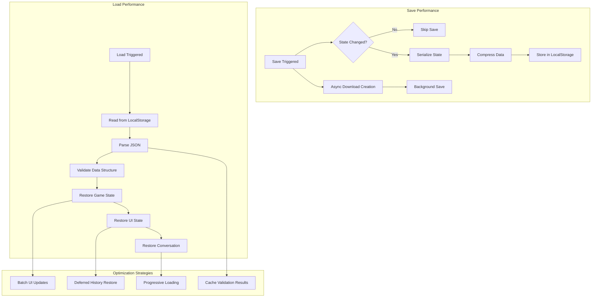

### Development Guidelines

**When Adding New Save Data:**
1. **Update interfaces** in `types/story.ts`
2. **Extend saveGame()** method in GameEngine
3. **Extend loadGame()** method with validation
4. **Add migration logic** for backward compatibility
5. **Update tests** to cover new data

**When Modifying UI State:**
1. **Consider save/load impact** - does this state need restoration?
2. **Update restoration callbacks** if UI state affects player experience
3. **Test with saved games** from previous versions
4. **Document breaking changes** in save format

**Memory Management:**
- Auto-save runs every 2 minutes - avoid expensive operations in save path
- Conversation history restoration happens on UI thread - keep it fast
- Use `InteractionPair[]` from MemoryManager instead of duplicating storage
- Clean up old saves periodically to avoid storage bloat

### Debugging Save/Load Issues

```typescript
// Debug utilities for save/load
class SaveManager {
  debugSaveData(): void {
    const saveData = this.gameEngine.saveGame();
    console.group('💾 Save Data Debug');
    console.log('Game State:', saveData.gameState);
    console.log('Memory State:', saveData.memoryState);
    console.log('Size:', JSON.stringify(saveData).length, 'bytes');
    console.groupEnd();
  }
  
  validateSaveCompatibility(saveData: string): boolean {
    try {
      const data = JSON.parse(saveData);
      const requiredFields = ['storyTitle', 'gameState', 'memoryState'];
      return requiredFields.every(field => field in data);
    } catch {
      return false;
    }
  }
}
```

## Troubleshooting

### Common Issues

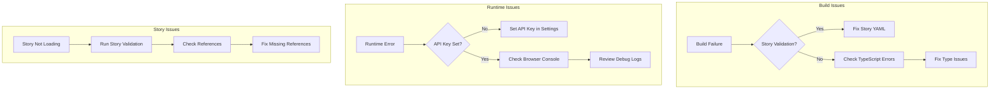

### Debug Tools

1. **Debug Pane**: Real-time LLM request/response inspection
2. **Browser DevTools**: Console logs and network inspection
3. **Story Validator**: Command-line story validation
4. **Test Suite**: Comprehensive automated testing
5. **Build Logs**: Detailed build process information

This development guide provides the foundation for productive work on the Iffy engine while maintaining code quality and system reliability.