# Story Engine Design

## Overview

The Iffy Story Engine is designed around Format v2, which emphasizes LLM-driven storytelling with authored structure and emergent content. The engine balances player freedom with narrative coherence through intelligent success condition detection and natural language processing.

## Story Format v2 Architecture

### Core Story Structure

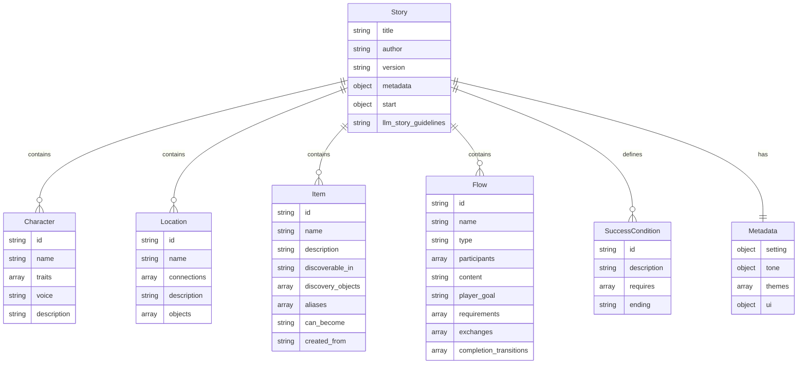

### Story Lifecycle

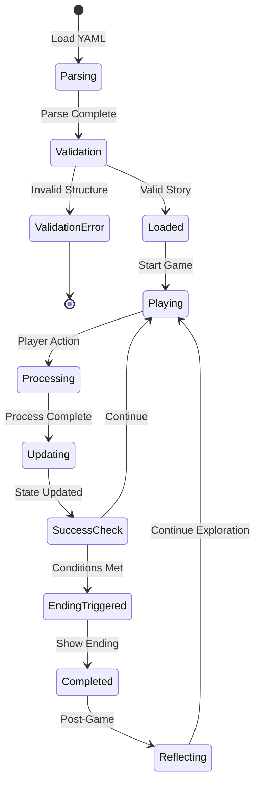

## Engine Components

### StoryParser

**Purpose**: Converts YAML story files into validated Story objects

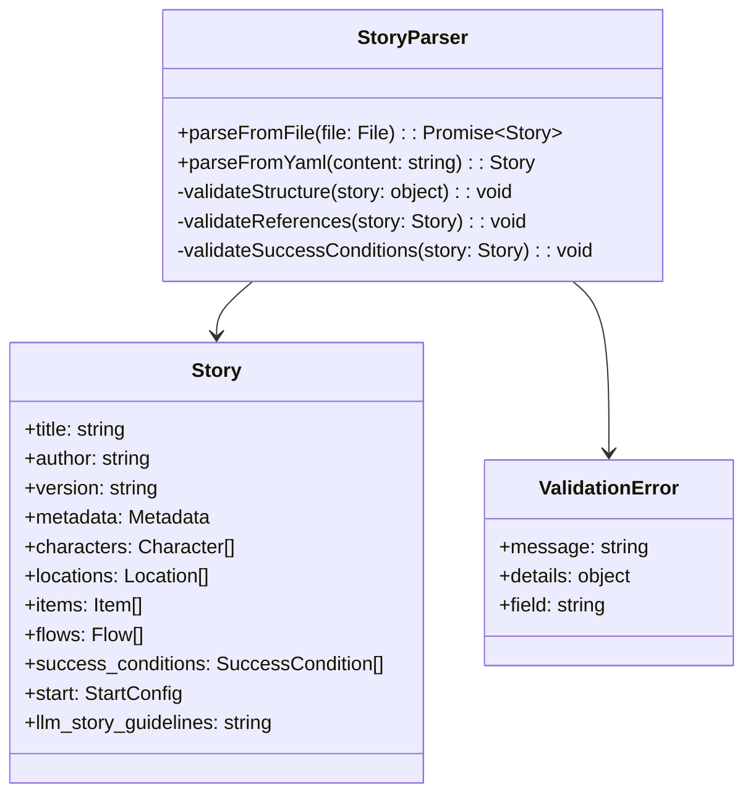

**Validation Rules**:
1. Required fields present
2. All references (locations, flows, items) exist
3. Success conditions reference valid knowledge flags
4. Start location and flow exist
5. Item transformation chains are valid

### GameEngine

**Purpose**: Manages game state and orchestrates story progression

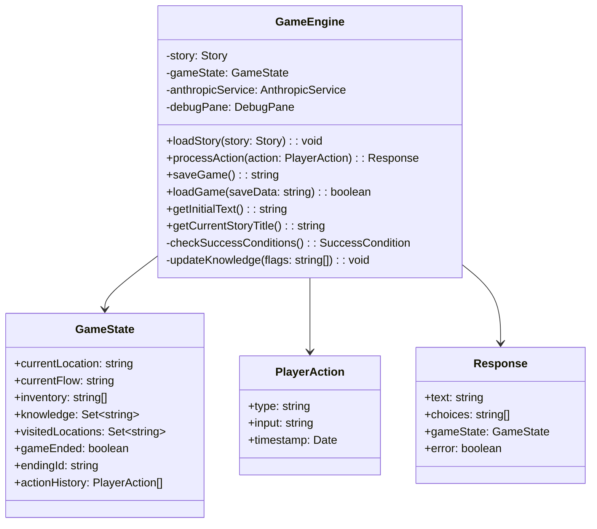

### Success Condition System

The success condition system enables engine-only ending detection, allowing the LLM to focus on natural responses while the engine handles story completion logic.

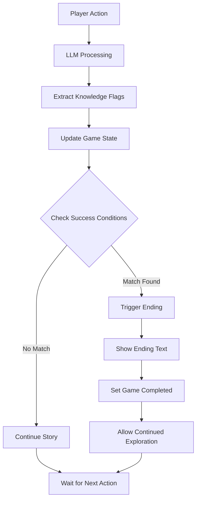

#### Success Condition Examples

```yaml
# Multiple ending paths based on knowledge gained
success_conditions:
  - id: "full_confession"
    description: "Prisoner reveals complete truth about motivation and tragedy"
    requires: ["learned child sick", "learned financial desperation", "learned child died", "prisoner opened up"]
    ending: |
      You close your notebook and stand up. The prisoner looks smaller now, 
      diminished by the weight of their confession. The truth is often more 
      tragic than the crime itself.

  - id: "partial_truth"
    description: "Prisoner admits to crime but doesn't reveal full context"
    requires: ["learned financial motivation", "prisoner defensive"]
    ending: |
      You have what you need for the case - a confession and motive. But 
      something tells you there's more to this story than simple greed.
```

## LLM Integration

### AnthropicService Architecture

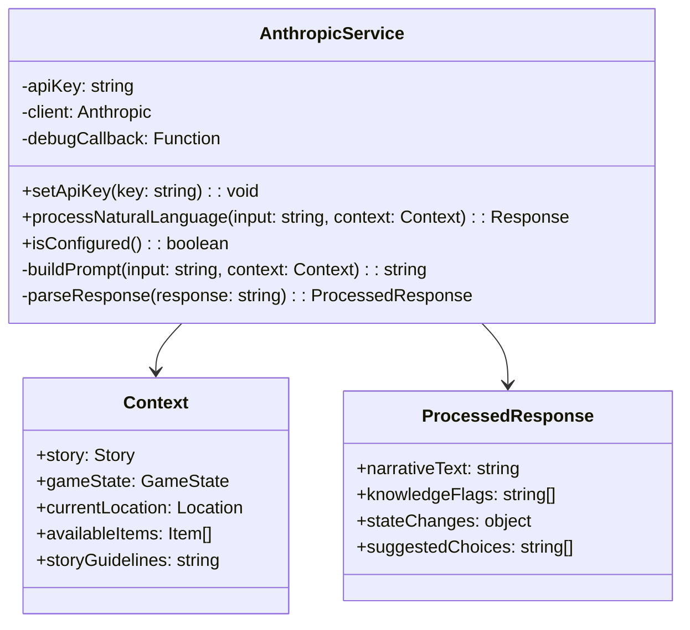

### LLM Prompt Structure

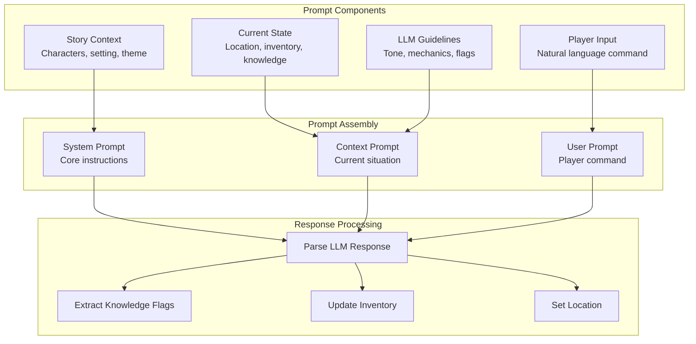

## Item System

### Item Transformation Mechanics

Format v2 introduces a flexible item transformation system that allows items to change state through player actions.

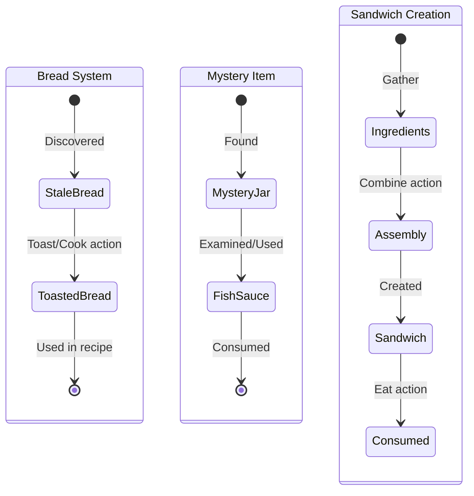

### Item Discovery System

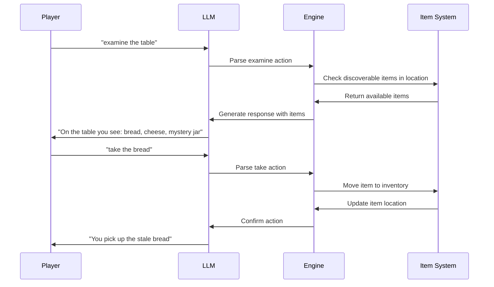

## Flow System

### Flow Types and Mechanics

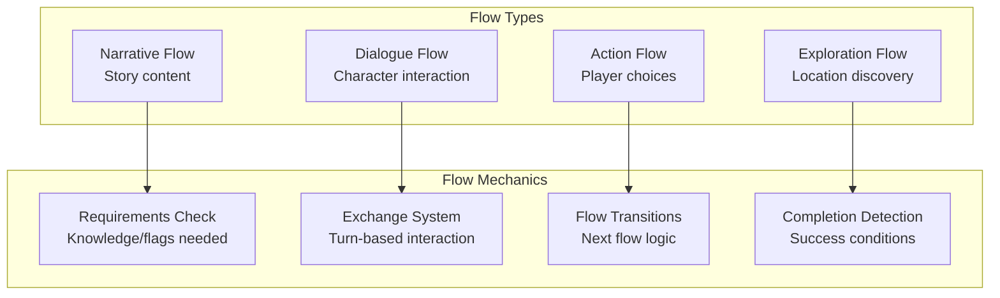

### Dialogue Flow Example

```yaml
flows:
  - id: "interrogation_start"
    name: "Opening Question"
    type: "dialogue"
    participants: ["player", "prisoner"]
    player_goal: "Understand the prisoner's motivation"
    exchanges:
      - speaker: "player"
        text: '"Why did you do it?" you ask directly.'
        choices:
          - text: "Wait for an answer"
            next: "patient_approach"
            sets: ["patient approach"]
          - text: "Press harder"
            next: "aggressive_approach"  
            sets: ["aggressive approach"]
```

## Knowledge System

### Knowledge Flag Management

The knowledge system tracks story progression through flags that are set by LLM responses and checked by success conditions.

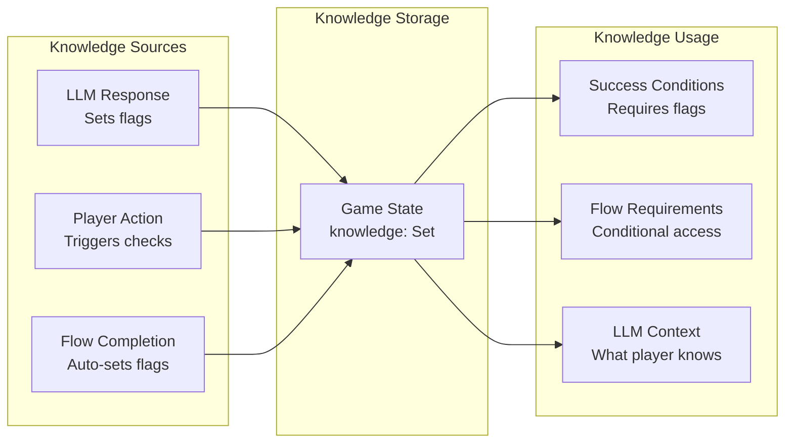

### Flag Naming Conventions

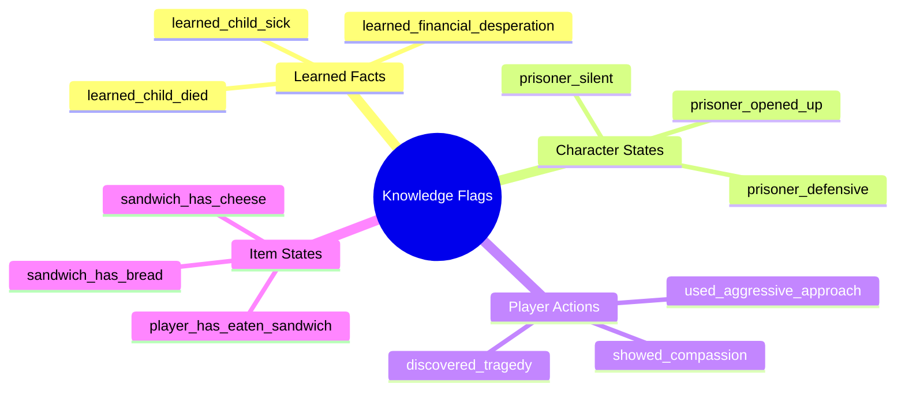

## Debugging and Development

### Debug System Architecture

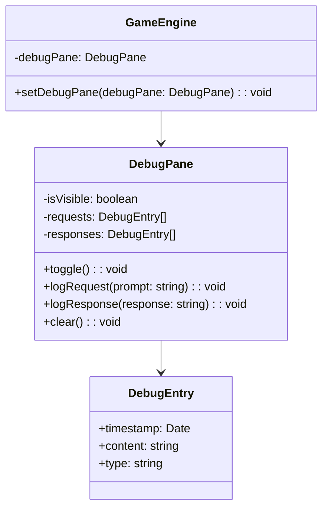

### Development Tools

1. **Story Validation**: Build-time validation of all story files
2. **Debug Pane**: Real-time LLM request/response inspection
3. **Knowledge Tracking**: Visibility into flag states
4. **Save/Load**: Quick iteration on game states
5. **Test Stories**: Simple stories for testing mechanics

## Performance Optimization

### Engine Performance Characteristics

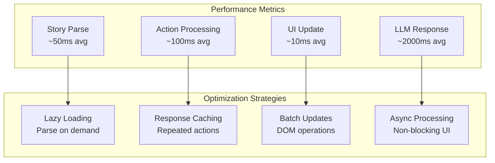

### Memory Management

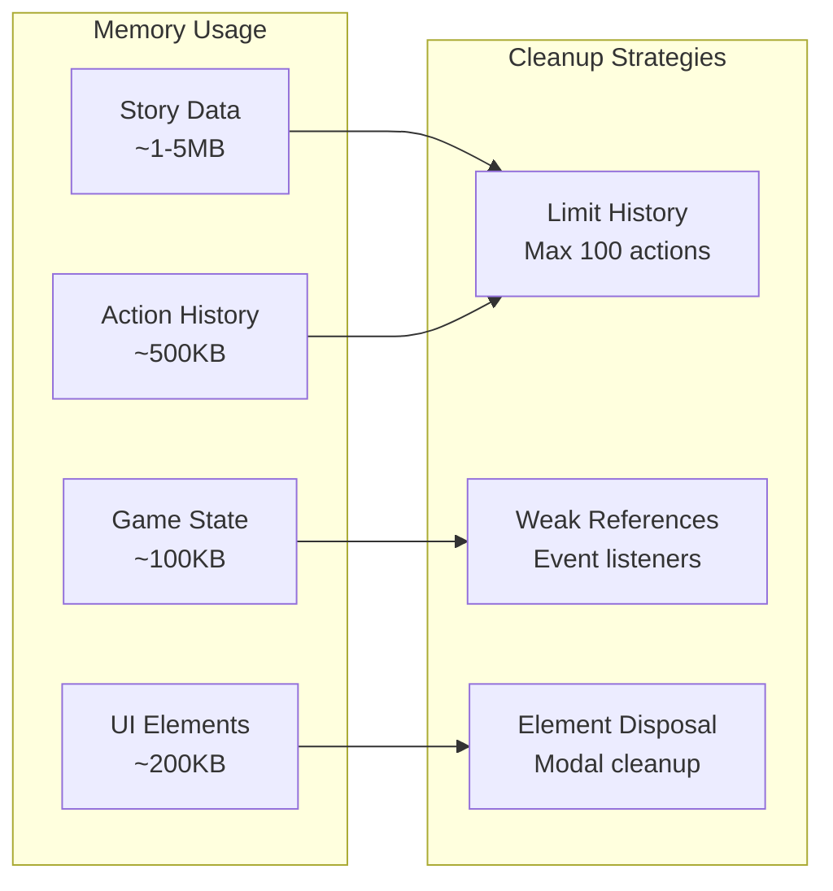

This engine design provides a robust foundation for creating engaging interactive fiction experiences while maintaining performance and developer productivity.