# UI Components Architecture

## Overview

The Iffy UI layer follows a modular manager pattern, where each manager class handles a specific aspect of the user interface. This design provides clear separation of concerns and makes the codebase more maintainable.

## Component Hierarchy

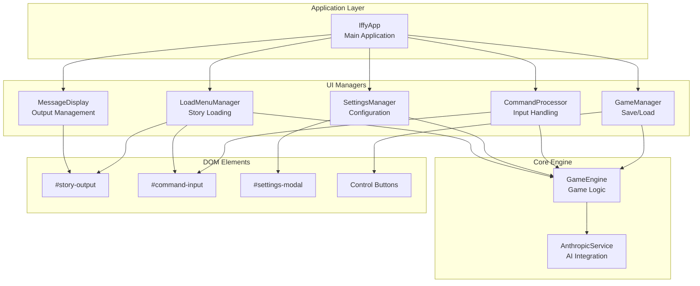

## Manager Responsibilities

### MessageDisplay
**Purpose**: Manages all story output and user messaging

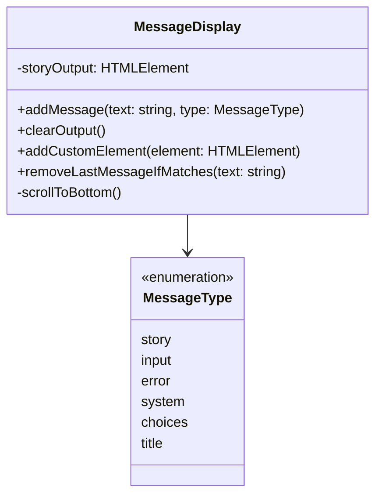

**Key Features**:
- Rich text rendering for story content
- Type-specific styling (errors, system messages, etc.)
- Automatic scrolling management
- Custom element insertion (API key prompts, etc.)

### LoadMenuManager
**Purpose**: Handles all story loading functionality

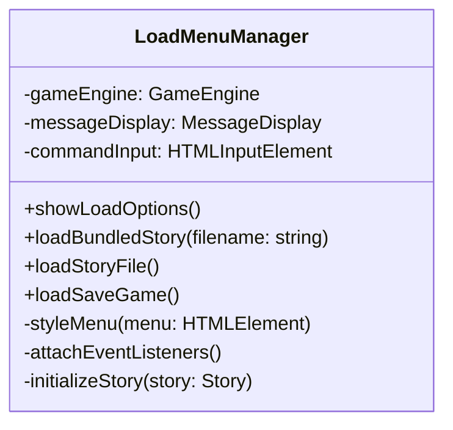

**Key Features**:
- Dynamic example story grid
- File picker integration
- Save game loading
- Complex modal styling
- Error handling with user feedback

### SettingsManager
**Purpose**: Manages application settings and API configuration

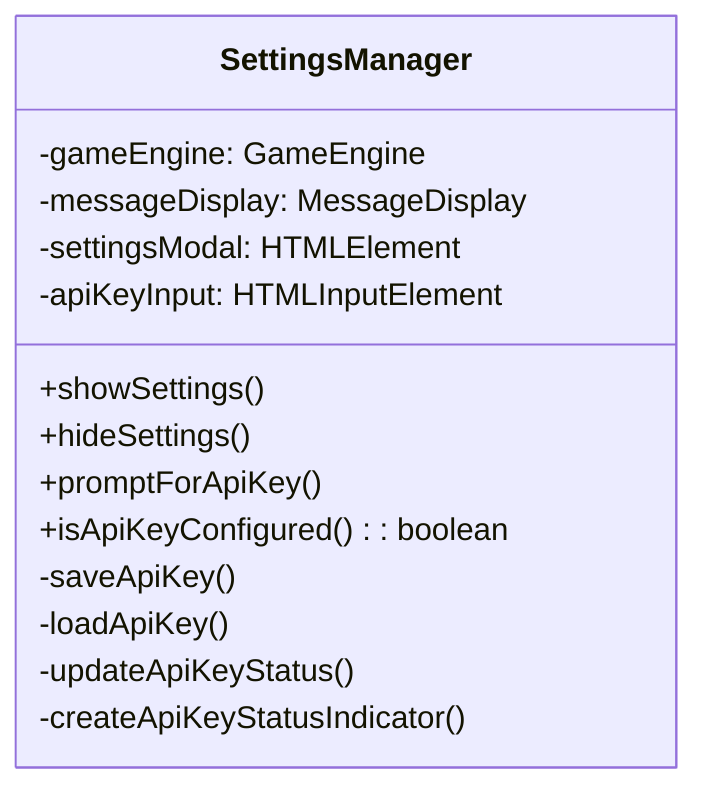

**Key Features**:
- API key persistence (localStorage)
- Status indicator management
- Interactive API key prompting
- Modal event handling

### CommandProcessor
**Purpose**: Handles user input and command processing

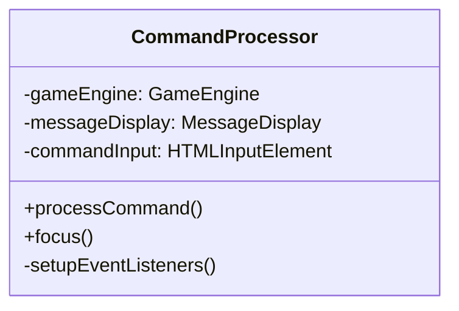

**Key Features**:
- Natural language command processing
- Rich text clickable elements
- Loading state management
- Error handling and recovery

### GameManager
**Purpose**: Manages game save/load operations

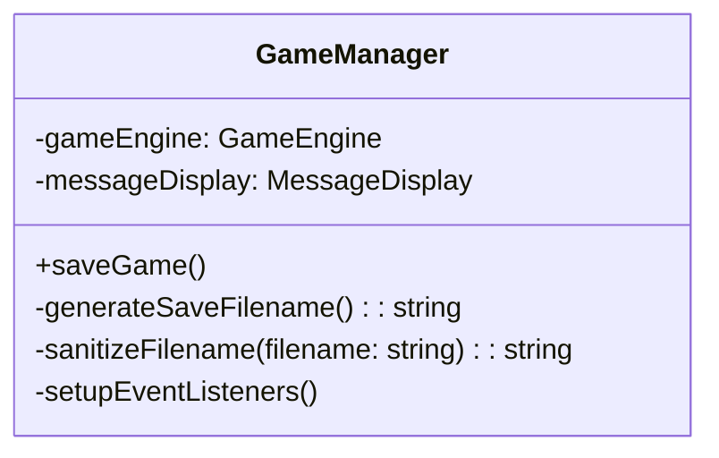

**Key Features**:
- Automatic filename generation
- Browser download integration
- Filename sanitization
- Timestamp-based naming

## Event Flow Patterns

### Command Processing Flow

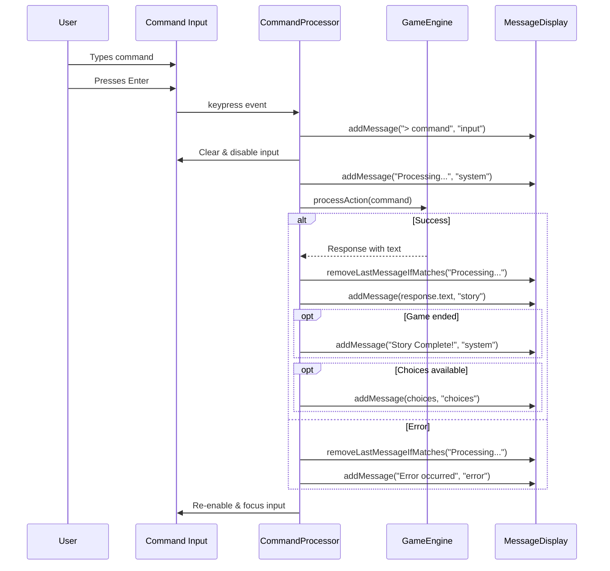

### Story Loading Flow

```mermaid
sequenceDiagram
    participant U as User
    participant LB as Load Button
    participant LMM as LoadMenuManager
    participant M as Modal Menu
    participant GE as GameEngine
    participant MD as MessageDisplay
    
    U->>LB: Click load
    LB->>LMM: showLoadOptions()
    LMM->>M: Create & style menu
    LMM->>M: Attach event listeners
    M-->>U: Display story options
    
    U->>M: Select example story
    M->>LMM: loadBundledStory(filename)
    LMM->>MD: addMessage("Loading...", "system")
    LMM->>GE: loadStory(parsedStory)
    GE-->>LMM: Story loaded
    LMM->>MD: clearOutput()
    LMM->>MD: addMessage(title, "title")
    LMM->>MD: addMessage(initialText, "story")
    
    opt First flow has content
        LMM->>MD: addMessage(flowContent, "story")
    else No content
        LMM->>GE: processAction("look")
        GE-->>LMM: Look response
        LMM->>MD: addMessage(response, "story")
    end
```

## Styling Architecture

### CSS Organization

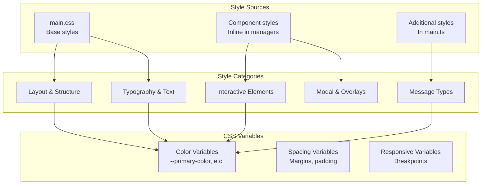

### Message Type Styling

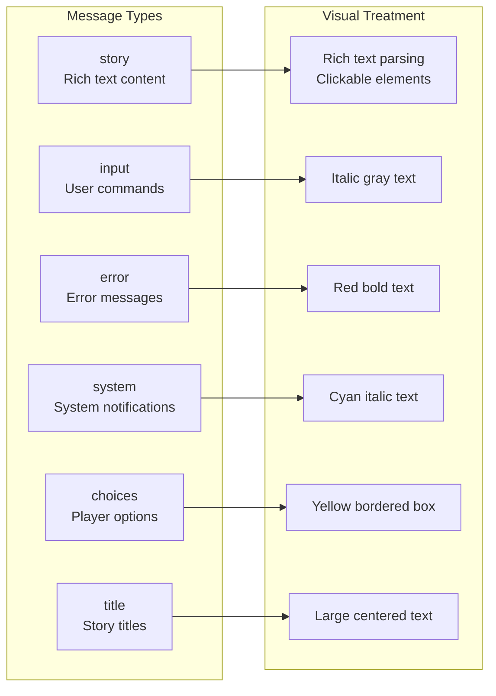

## State Management

### Manager State Dependencies

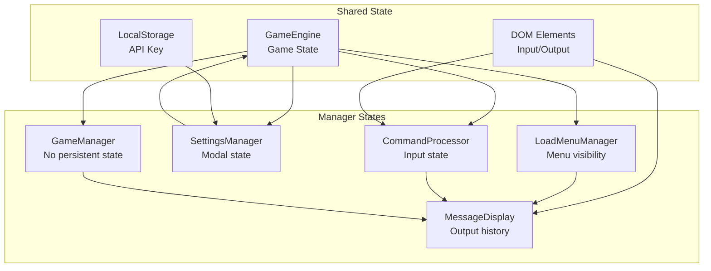

## Error Handling Strategy

### Error Flow Pattern

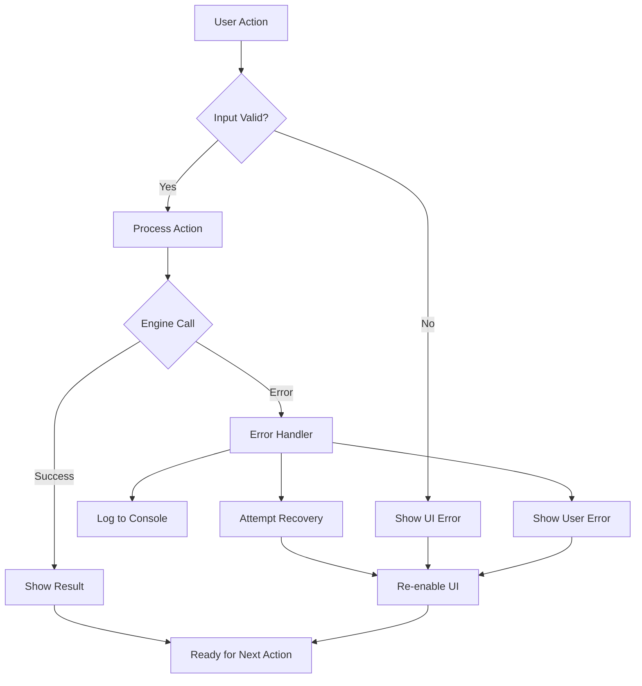

### Error Types and Handling

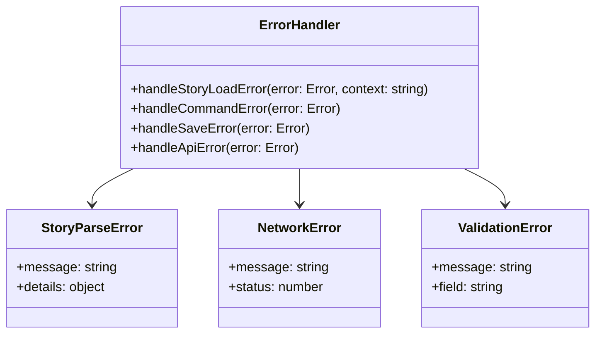

## Performance Considerations

### Optimization Strategies

1. **Event Delegation**: Single document listener for clickable elements
2. **Lazy Loading**: Managers only initialize when needed
3. **Memory Management**: Remove event listeners on cleanup
4. **DOM Efficiency**: Batch DOM updates where possible
5. **CSS Performance**: Use CSS variables for dynamic styling

### Bundle Size Impact

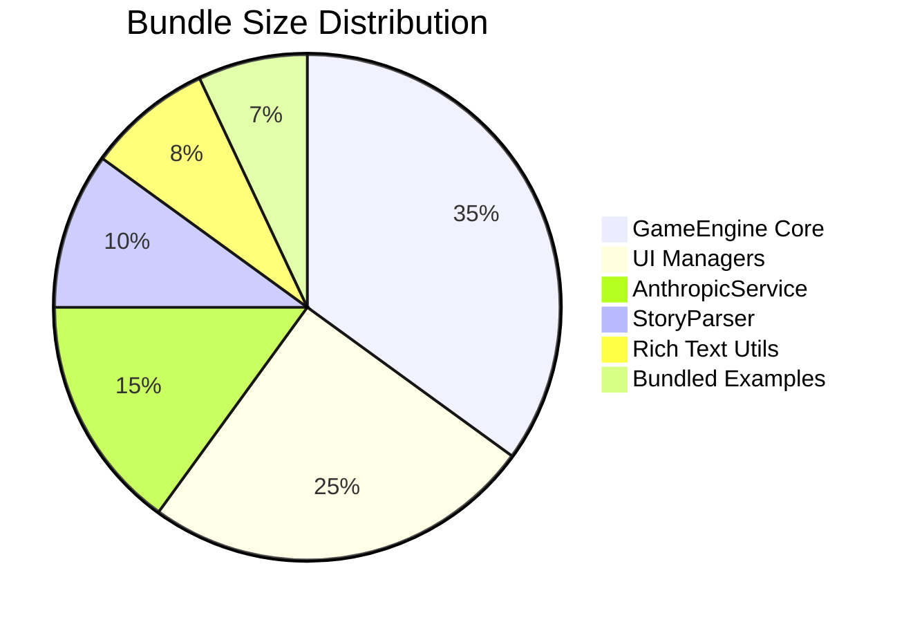

## Testing Strategy

### Component Testing Approach

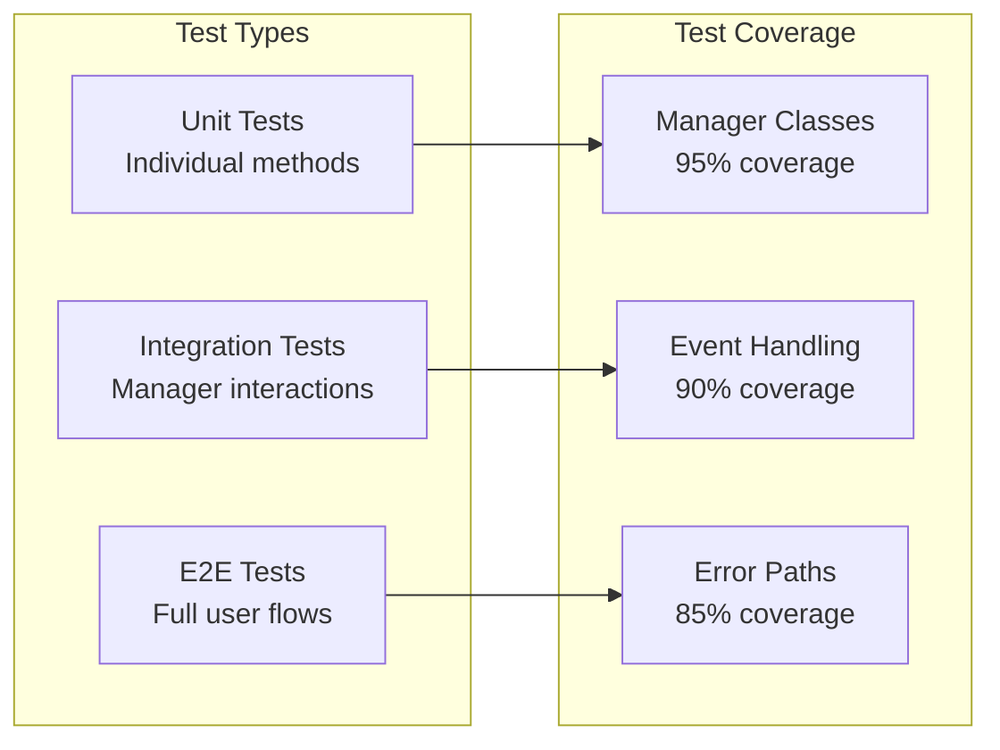

This modular UI architecture provides a solid foundation for maintaining and extending the Iffy engine while keeping concerns properly separated and testable.